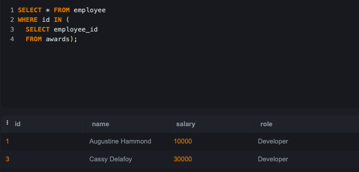
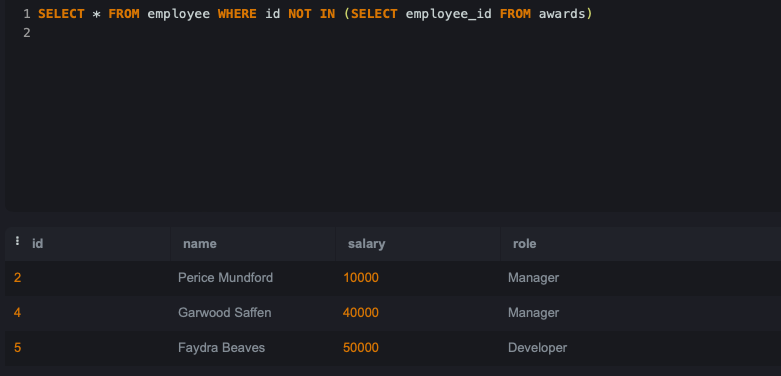
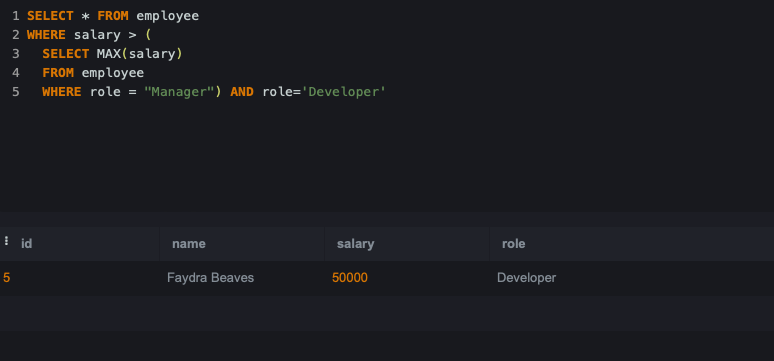
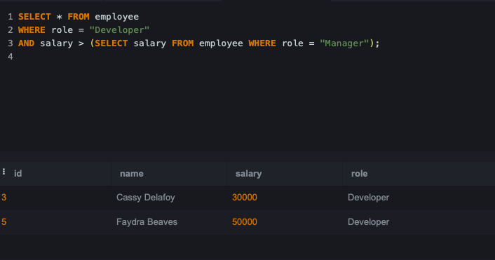
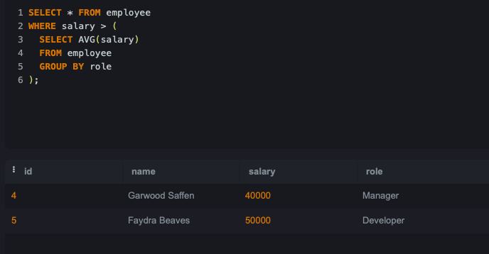

# SQL-Lab2

# We will use the Employees and Awards table below:

 

### Q1: Choose all employees who have received an award (Nested Query)?
 
 

### Q2: Choose all employees who have never received an award (Nested Query)?
 
 
### Q3: Choose all Developers who make more than all Managers combined (Nested Query)?
 

 
### Q4: Choose all Developers who make more money than any Manager (Nested Query)?
 
 
### Q5: Choose all employees whose salaries are higher than the average for their position. (Nested Query)?
 
